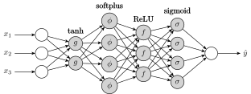
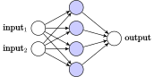

# TikzNeuralNetworks.jl

[](https://github.com/mossr/TikzNeuralNetworks.jl/actions)
[](https://codecov.io/gh/mossr/TikzNeuralNetworks.jl)

Visualize neural networks using TikZ in Julia. Uses [TikzGraphs.jl](https://github.com/JuliaTeX/TikzGraphs.jl) as a backend and outputs a [`TikzPicture`](https://github.com/JuliaTeX/TikzPictures.jl).

<p align="center"></p>

## Installation
```julia
] add https://github.com/mossr/TikzNeuralNetworks.jl
```
---
```julia
using TikzNeuralNetworks
```

## Examples

A `TikzNeuralNetwork` will output to SVG within Jupyter and Pluto noteboks, and can be saved to PDF/SVG/TEX (see below).

```julia
nn = TikzNeuralNetwork()
```
<p align="center"></p>


```julia
nn = TikzNeuralNetwork(input_size=3,
                       hidden_layer_sizes=[2, 4],
                       output_size=2)
```
<p align="center"></p>


```julia
nn = TikzNeuralNetwork(input_size=3,
                       input_label=i->"\$x_{$i}\$",
                       hidden_layer_sizes=[2, 4, 3, 4],
                       activation_functions=[L"\tanh", "softplus", "ReLU", "sigmoid"],
                       hidden_layer_labels=(h,i)->["{\\scriptsize\$a_{$j}^{[$h]}\$}" for j in 1:i],
                       output_size=1,
                       output_label=i->L"\hat{y}",
                       node_size="24pt")
```
<p align="center"></p>


```julia
nn = TikzNeuralNetwork(input_size=2,
                       input_arrows=false,
                       hidden_layer_sizes=[4],
                       hidden_color="blue!20",
                       output_size=1,
                       output_arrows=false)
```
<p align="center"></p>

## Structure

```julia
@with_kw mutable struct TikzNeuralNetwork
    input_size::Int = 1
    input_label::Function = i->string("input", input_size==1 ? "" : "\$_{$i}\$")
    input_arrows::Bool = true
    hidden_layer_sizes::Vector{Int} = [1]
    hidden_layer_labels::Function = (h,i)->fill("", i)
    activation_functions::Vector{String} = fill("", length(hidden_layer_sizes))
    hidden_color::String = "lightgray!70"
    output_size::Int = 1
    output_label::Function = i->string("output", output_size==1 ? "" : "\$_{$i}\$")
    output_arrows::Bool = true
    node_size::Union{String,Real} = "16pt"
    tikz::TikzPicture = TikzPicture("")
end
```

Note that `hidden_layer_labels` is a function with input (`hidden layer index`, `node index within layer`) that returns a vector the size of the number of nodes within layer `h`.

## Saving
Saving piggy-backs on [TikzPictures.jl](https://github.com/JuliaTeX/TikzPictures.jl).

```julia
save(PDF("nn.pdf"), nn)
save(SVG("nn.svg"), nn)
save(TEX("nn.tex"), nn)
```

---
Written by [Robert Moss](https://github.com/mossr).